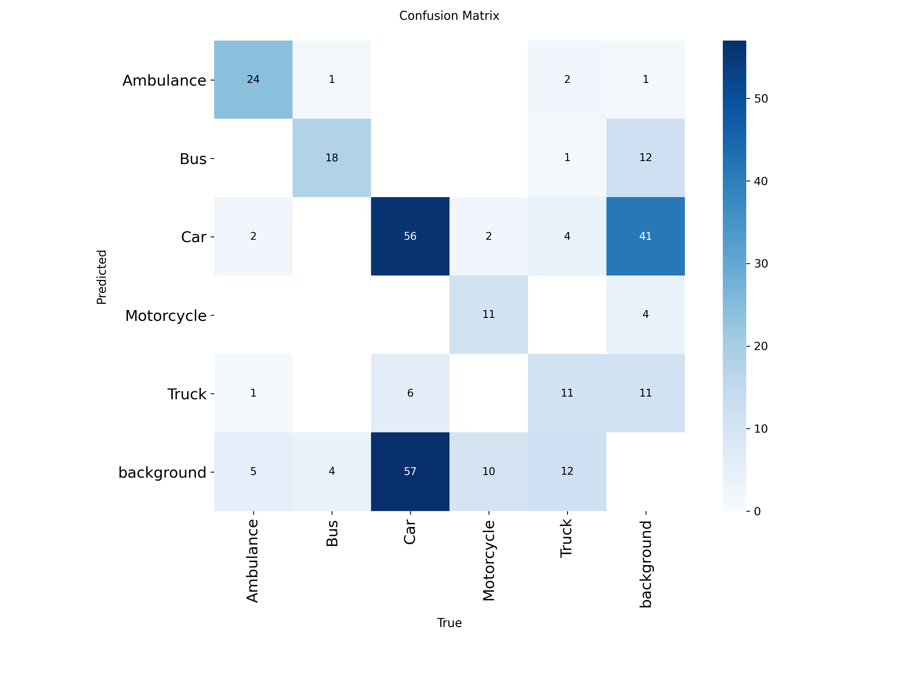

# 🚀 Real-Time Object Detection using YOLOv8 (Images & Videos)

## 📌 Project Overview
This project implements an end-to-end Object Detection system using Ultralytics YOLOv8.  
The system supports:

- Custom model training on a labeled dataset
- Performance evaluation using mAP, Precision, Recall
- Inference on images, videos, and webcam
- Streamlit-based web deployment

---

## 🧠 Skills Demonstrated

- Computer Vision fundamentals (IoU, Confidence, NMS)
- YOLOv8 training & inference (train / val / predict)
- Dataset preparation in YOLO format
- Model evaluation and error analysis
- Real-time detection on image & video
- Streamlit deployment

---

## 📂 Dataset

Custom Vehicle Detection Dataset (YOLO format)

Structure:

data/
├── images/
│   ├── train/
│   └── val/
├── labels/
│   ├── train/
│   └── val/
└── data.yaml

Classes:
- Ambulance
- Bus
- Car
- Motorcycle
- Truck

---

## ⚙️ Training Details

Model: yolov8n.pt  
Epochs: 100  
Image Size: 640 / 800  
Batch Size: 16  
Device: GPU (Google Colab)

---

## 📊 Model Performance

| Metric | Score |
|--------|-------|
| mAP@0.5 | 0.57 |
| mAP@0.5:0.95 | 0.40 |
| Precision | 0.66 |
| Recall | 0.53 |

---

## 📈 Confusion Matrix

---

## 🎥 Inference Capabilities

- Dataset image testing
- Dataset video testing
- Upload image
- Upload video
- FPS counter
- Model selection (COCO + Custom)

---

## 🌐 Deployment

Streamlit Cloud App  
Model options:
- Pretrained COCO model (yolov8n.pt)
- Custom trained model (best.pt)

---

## 📦 Project Structure

YOLOv8_object_detection/
│
├── app.py
├── best.pt
├── yolov8n.pt
├── metrics.txt
├── confusion_matrix.png
├── requirements.txt
└── datasets/

---

## 🏁 Conclusion

The custom-trained YOLOv8 model achieved moderate detection performance.  
While vehicle detection works well for larger objects, improvements can be made for small object detection by increasing dataset size and applying stronger augmentation techniques.

---

## 🔮 Future Improvements

- Increase dataset size (1000+ images)
- Add Person class for traffic scenes
- Implement object counting
- Export model to ONNX
- Add analytics dashboard

Author : Ashish Mehara (Ashu)
## 🛠 Tech Stack

YOLOv8, PyTorch, OpenCV, Streamlit, Python, Ultralytics
